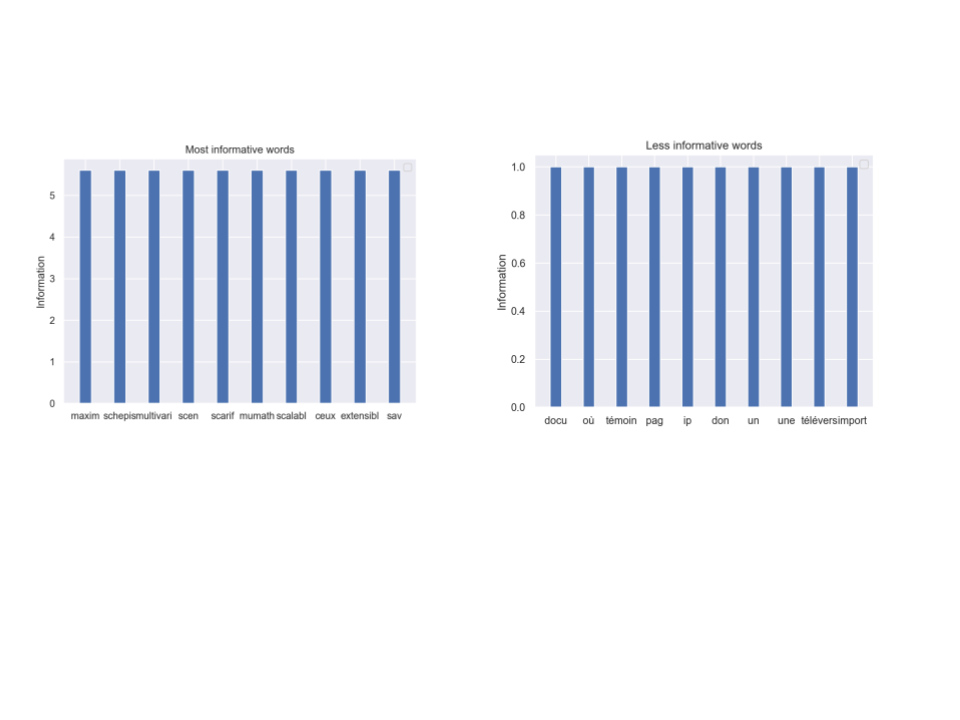

# wiki_index

Indexation du web 
=================

Première étape :
---------------

Récuperer les données :      
Première étape c'est de collecter les données en scrappant le web :    
- Utiliser l'architecture en graph du web pour naviguer de lien en lien à partir d'un point de départ en conservant en mémoire le nom des pages déjà visité.    
- Attention compléxité !!      
    Nk: Nb of pages with > k incoming links. Nk/2 ≈ 2^y .Nk (Zipf’s law).    

    NL: Nb of pages of length > L. NL/2 ≈ 2^y .NL (Zipf’s law).         
- Puis transformer html to markdown pour supprimer les balises       

Deuxième étape c'est de séparer le texte par unité de sens => tokenization.     
Puis diminuer le nombre de tokens en utilisant le stemming (regroupements des mots de mêmes racines).    

Construction de la matrice tf (time frequency)    
tf = doc\tokens (fréquence d'apparition des tokens dans les documents)       
tf_idf = matrice doc\token normalisé par la quantité d'information apporté par chaque tockens       

Si l'on regarde l'importance des mots pour 50 pages Wikipédia swcraller de manière aléatoire :  
 
Latent space semantic :      
- On calcul l'information apporté par chaque token dans le document (-log(p(x))    

- On cherche les valeurs propres de la matrice (tf^t)*(tf) puis diagonalise la matrice   

